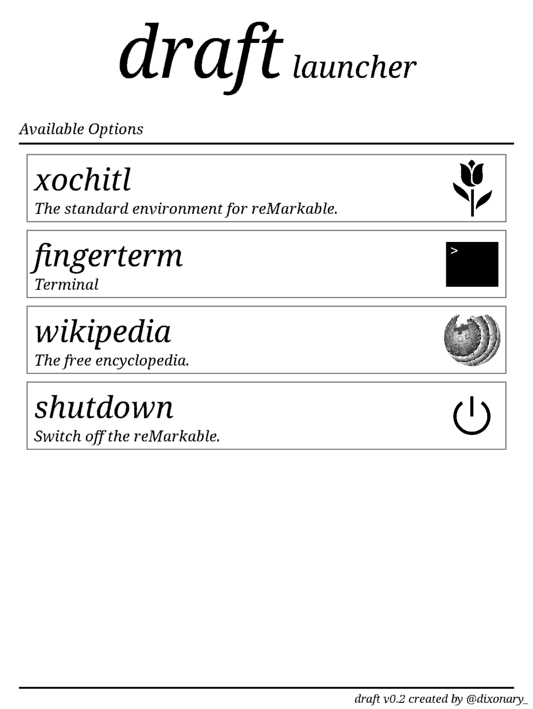
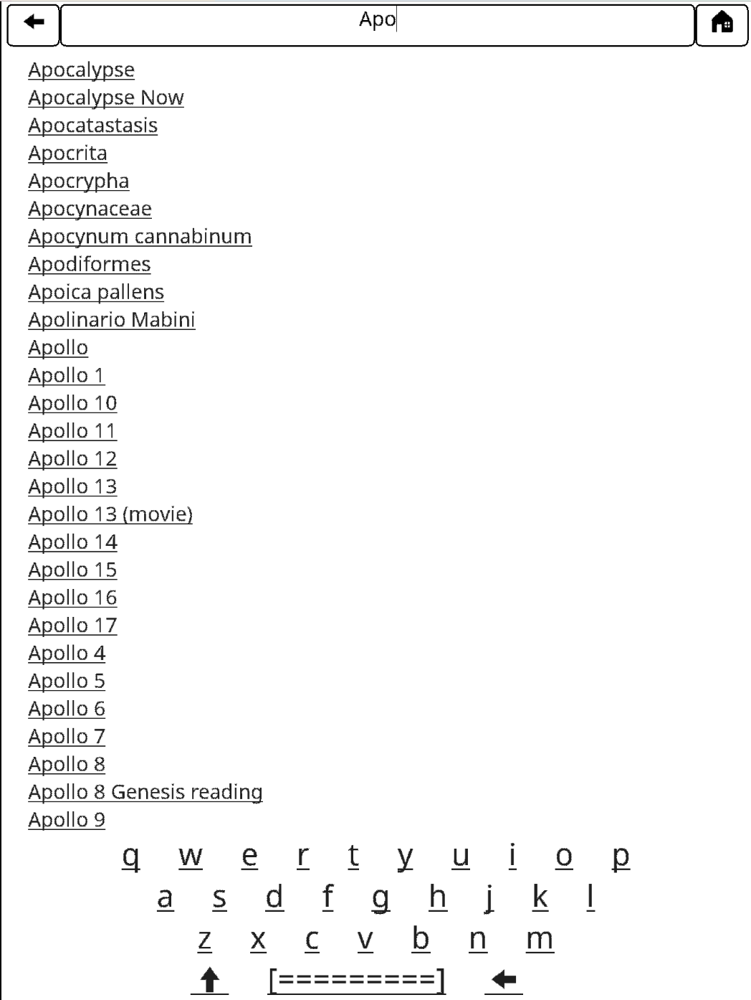
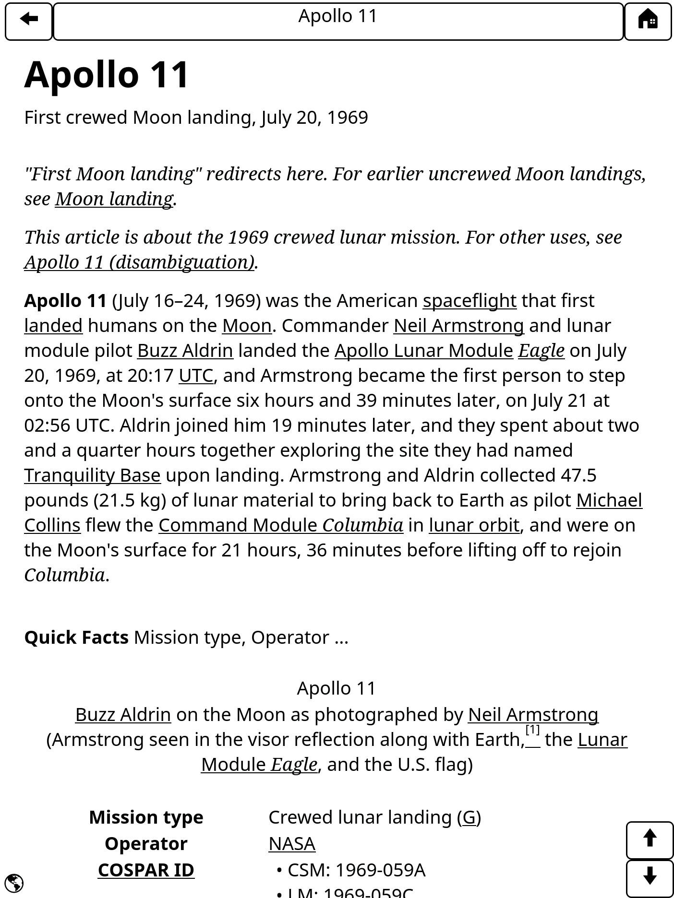

# remarkable-wikipedia

When I was a kid, the ([apocryphal!](https://en.wikipedia.org/wiki/Library_of_Alexandria)) story of the fire at the library of Alexandria, the supposed loss of most human knowledge acquired to that date, was something that made me sad.  But in 1994, I became the excited owner of a [Microsoft Encarta](https://www.youtube.com/watch?v=QEE8bXCxhsE) CD and a Creative Labs CD-ROM drive that plugged in to my PC's soundcard. Optical disks with 750MB capacity - enough to store an whole *encyclopedia*, to replace the heaving bookshelves of Brittanica, were a technological marvel. How lucky we are, I'd think to myself, that the sum total of human knowledge is right here in my hand and could never become lost to future humankind. Today, of course, every CD-ROM I ever owned is unusable on modern devices and I understand that there's much more to human knowledge than fits in 750 MB, but the thought stuck with me. Wouldn't it be cool to have my own self-contained personal repository of human knowledge, accessible without an internet connection - my very own library of Alexandria? Wikipedia is today's canonical descendant of Encarta and Brittanica - wouldn't it be great to be able to carry it around and consult it wherever and whenever I wanted?

After years of kicking this idea around in my head, a chat with friends who apparently wanted it too and a snowy weekend in May provided the catalyst to actually make it happen!

<blockquote class="twitter-tweet" data-lang="en">
Over the long weekend, I built a thing I have wished existed for years - this is *all* of Wikipedia, available offline on my <a href="https://twitter.com/remarkablepaper?ref_src=twsrc%5Etfw">@remarkablepaper</a> tablet. <a href="https://t.co/mWewIzfOFx">pic.twitter.com/mWewIzfOFx</a>
&mdash; David Singleton (@dps) <a href="https://twitter.com/dps/status/1133608364913582080?ref_src=twsrc%5Etfw">May 29, 2019</a></blockquote>

This was a fun thing to build and is an even more fun thing to use, and judging by the response on Twitter, it's something other people would like too, so here are the instructions on how to build your very own hitchhiker's guide to the galaxy.

* First, you'll need a [reMarkable tablet](https://remarkable.com/store/reMarkable-and-marker) - at $499 it's not cheap but it's a great note taking device in its own right and [delightfully open and hackable](https://remarkable.engineering/) which is sadly no longer true of the Kindle. *You hack on the internals of your reMarkable at your own risk - if you brick your tablet it's not my fault*.

* To store all of English wikipedia, you'll need an [external memory card (>=64GB)](https://www.amazon.com/SanDisk-128GB-microSDXC-Memory-Adapter/dp/B073JYC4XM/ref=sr_1_4?crid=OLNAM00YTN35&keywords=128gb+micro+sd+card&qid=1558567754&s=gateway&sprefix=128%2Caps%2C187&sr=8-4), [USB card reader](https://www.amazon.com/Sandisk-Mobile-MicroMate-microSDHC-SDDR-121/dp/B001QLFNCC/ref=sr_1_5?keywords=tiny+sandisk+usb+micro+sd+card+reader&qid=1558567875&s=gateway&sr=8-5) and [micro USB OTG dongle](https://www.amazon.com/UGREEN-Adapter-Samsung-Controller-Smartphone/dp/B00LN3LQKQ/ref=sxin_2_ac_d_rm?keywords=micro+usb+otg&pd_rd_i=B00LN3LQKQ&pd_rd_r=a3273953-2455-4c7c-b843-e9d211a7a48e&pd_rd_w=jYXMf&pd_rd_wg=DTUE3&pf_rd_p=0bc35c17-1e0d-4808-b361-20ab11b00973&pf_rd_r=N5WH7B8SJZDMF3HN4NV3&qid=1559365441&s=gateway).

Once all the kit has arrived, you'll need to format the memory card as `ext4`, which is most easily done by connecting it to a Linux machine (I used a Raspberry Pi), but is [also possible with pain on Mac OS X](https://apple.stackexchange.com/questions/171506/formatting-usb-disk-as-ext4-on-mac), seriously, just find a Linux box.

Next, download wikipedia to the memory card. The awesome folks over at the [kiwix project](http://www.kiwix.org) maintain an archive of wikipedia pre-compressed into the compact [zim file format](https://www.openzim.org/wiki/ZIM_file_format).

* Visit the kiwix [content packages](https://wiki.kiwix.org/wiki/Content_in_all_languages) page and download the version of wikipedia you want. I recommend grabbing both [Simple English wikipedia](http://download.kiwix.org/zim/wikipedia_en_simple_all_nopic.zim), which at 354M (in May 2019), fits comfortably in the internal storage of the reMarkable and [Full English wikipedia](http://download.kiwix.org/zim/wikipedia_en_all_nopic.zim) (35 GB).

* Copy the full wikipedia file into the root directory of your `ext4` formatted sdcard *and call it `wikipedia.zim`*

Now we'll configure the reMarkable. We're going to install a new launcher called *draft* by [@dixonary_](https://twitter.com/dixonary_), a `zim file server` and a little custom UI app I built. We'll also configure *draft* to run on start up instead of the built in launcher (called `xochitl`) and add some incantantions to mount the sdcard and run the `zim` server.

* Enable passwordless ssh to your reMarkable from your computer. When you connect the reMarkable to wifi, or when you plug it in to your computer via USB you can `ssh` in to the tablet as `root`. The root password and the IP address(es) it's listening on are listed on the About screen (see what I mean about it being *delightfully* hackable!?). We're going to connect and disconnect a lot so typing that password in is going to be a pain, so let's first set up passwordless SSH. Follow [these instructions at remarkablewiki.com](https://remarkablewiki.com/tech/ssh) - the `ssh-copy-id` route is easiest.

It is possible to build all the stuff I'm about to recommend from source code, and you'll find decent tutorials linked from [awesome-remarkable](https://github.com/reHackable/awesome-reMarkable) -- if you don't trust me not to have modified the contents of the binaries you should definitely do that! It's a major yak shave to set up all the toolchains however, so if you *do* trust me, you'll find all the binaries you need in [my github repo](https://github.com/dps/remarkable-wikipedia/tree/master/bin).

* clone the repo `git clone https://github.com/dps/remarkable-wikipedia.git`
* cd into the `bin` directory
* set your reMarkable's IP address in the environment variable `REMARKABLE_IP`
  * e.g. `export REMARKABLE_IP=10.11.99.1`
* run the install script `./install.sh`

When the install script is done, your tablet will reboot to the _draft_ launcher homescreen, which will look something like this:
  
You can enter the standard reMarkable UI by tapping `xochitl`.

Tapping *wikipedia* will start `qtremarkable` and render the wikipedia main page. Assuming the external memory card was attached when the tablet booted, you'll see the main page of full wikipedia. Otherwise, if you put simple english wikipedia on the internal memory, you'll see that version instead.

You can *quit* `qtremarkable` (or any other app launched by draft) by holding the middle hardware button for more than one second and releasing it. But you don't want to do that - there's so much wikipedia to read!

Tapping in the address bar at the top of the screen will bring up a keyboard so you can start looking for a specific wikipedia page. These suggestions are *case-sensitive*.
  

Once you have found the page you're looking for, the right and left hardware keys scroll a full page down or up the article respectively. Tapping on links moves through articles as you'd expect and the *back* and *home* buttons at the top do what you'd expect.

Enjoy reading and learning!
  

