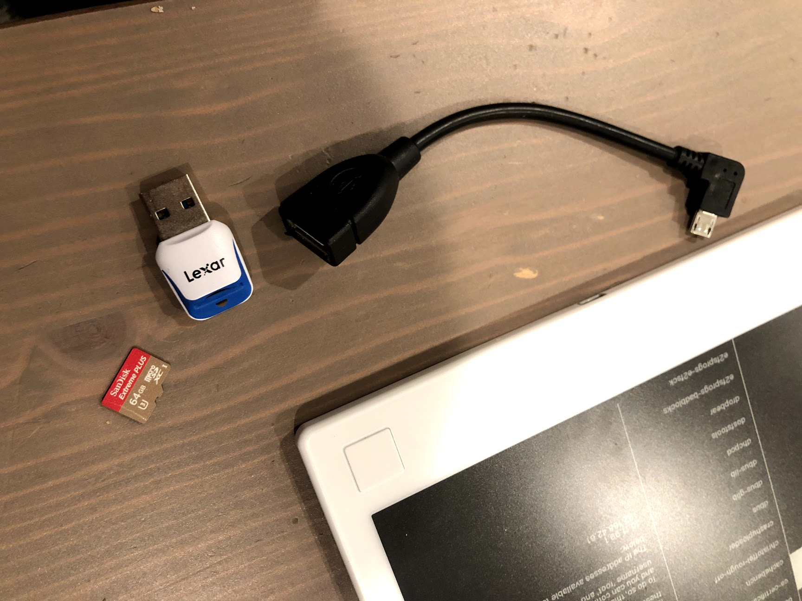
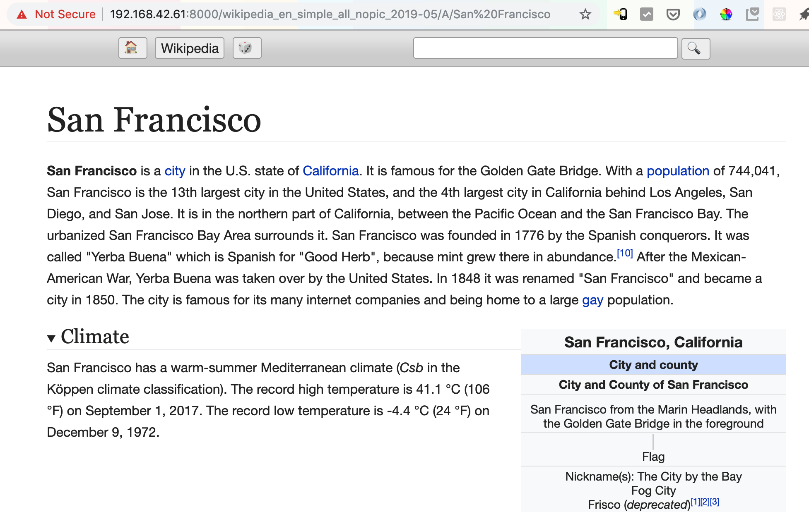

# Remarkable wikipedia notes

SSH Access to reMarkable: https://remarkablewiki.com/tech/ssh

List of projects: https://github.com/reHackable/awesome-reMarkable

best repo to build on (I got this working easily)
https://github.com/merovius/srvfb

new launcher UI:
https://github.com/dixonary/draft-reMarkable

Plato eReader:
https://www.reddit.com/r/RemarkableTablet/comments/bkbps9/how_to_install_plato_reader_and_add_it_to_draft/?st=jvp0mqus&sh=0651e353

Source code of the port:
https://github.com/darvin/plato

Needs QT Creator to build from source. This is probably the best thing to start hacking into a wikipedia reader UI.

# Offline wikipedia notes

* First time around, I downloaded and processed all of wikipedia on a large server. This might be useful if you decide to go down that route: https://blog.singleton.io/posts/2012-06-19-parsing-huge-xml-files-with-go/

* Then I discovered 
https://en.wikipedia.org/wiki/ZIM_(file_format)
and
https://www.kiwix.org/en/downloads/

here's the actual wikipedia download:
https://wiki.kiwix.org/wiki/Content_in_all_languages

It's 35G with no images and 79G with no video
```
wikipedia (English)	en	35G	2018-09	all nopic
wikipedia (English)	en	79G	2018-10	all novid
```

Here's how to build a zim file extracting webserver:
https://github.com/kiwix/kiwix-tools/blob/master/README.md

I think that plus a UI that fetches the content locally and renders in plato is likely the full solution!

The reMarkable only has about 6.5 GB internal storage. I think a USB-otg cable plus sdcard might work.
*update*
confirmed that this should work:
```
[   28.969911] ci_hdrc ci_hdrc.0: EHCI Host Controller
[   28.974832] ci_hdrc ci_hdrc.0: new USB bus registered, assigned bus number 1
[   29.001642] ci_hdrc ci_hdrc.0: USB 2.0 started, EHCI 1.00
[   29.009871] hub 1-0:1.0: USB hub found
[   29.019532] hub 1-0:1.0: 1 port detected
[   29.341644] usb 1-1: new high-speed USB device number 2 using ci_hdrc
[   29.498532] usb-storage 1-1:1.0: USB Mass Storage device detected
[   29.507247] scsi host0: usb-storage 1-1:1.0
[   30.513081] scsi 0:0:0:0: Direct-Access     Lexar    microSD RDR      0815 PQ: 0 ANSI: 6
[   30.861919] sd 0:0:0:0: [sda] 124735488 512-byte logical blocks: (63.9 GB/59.5 GiB)
[   30.870522] sd 0:0:0:0: [sda] Write Protect is off
[   30.875358] sd 0:0:0:0: [sda] Mode Sense: 23 00 00 00
[   30.879929] sd 0:0:0:0: [sda] Write cache: disabled, read cache: enabled, doesn't support DPO or FUA
[   30.898892]  sda: sda1
[   30.908340] sd 0:0:0:0: [sda] Attached SCSI removable disk
[  387.157818] usb 1-1: USB disconnect, device number 2
[  387.442193] usb 1-1: new high-speed USB device number 3 using ci_hdrc
[  387.598722] usb-storage 1-1:1.0: USB Mass Storage device detected
[  387.606932] scsi host1: usb-storage 1-1:1.0
[  387.773963] usb 1-1: USB disconnect, device number 3
[  387.798539] ci_hdrc ci_hdrc.0: remove, state 1
[  387.803032] usb usb1: USB disconnect, device number 1
[  387.824825] ci_hdrc ci_hdrc.0: USB bus 1 deregistered
```

It looks like the remarkable supports EXT4 for the internal drive:
```
[    7.553171] EXT4-fs (mmcblk1p7): mounted filesystem with ordered data mode. Opts: (null)
```


# Hardware concept

Here's a thing I think you could build - a sleeve that the reMarkable plugs in to that has a micro USB plug at the end, connects to an SDcard inside the package and also to a solar panel covering the whole back surface.


# Some more bits of the recipe
```
scp zims/wikipedia_en_simple_all_nopic_2019-05.zim root@192.168.42.61:
```

```
curl https://mirrors.dotsrc.org/kiwix/release/kiwix-tools/kiwix-tools_linux-armhf-1.2.1.tar.gz > kiwix-tools_linux-armhf-1.2.1.tar.gz
tar -xzf kiwix-tools_linux-armhf-1.2.1.tar.gz
scp kiwix-tools_linux-armhf-1.2.1/kiwix-serve root@192.168.42.61:
```

# Got kiwix-serve running on reMarkable!
```
$ ssh root@192.168.42.61
ｒｅＭａｒｋａｂｌｅ
╺━┓┏━╸┏━┓┏━┓   ┏━╸┏━┓┏━┓╻ ╻╻╺┳╸┏━┓┏━┓
┏━┛┣╸ ┣┳┛┃ ┃   ┃╺┓┣┳┛┣━┫┃┏┛┃ ┃ ┣━┫┗━┓
┗━╸┗━╸╹┗╸┗━┛   ┗━┛╹┗╸╹ ╹┗┛ ╹ ╹ ╹ ╹┗━┛
remarkable: ~/ ls
documents                                  log.txt                                    plato-remarkable                           wikipedia_en_simple_all_nopic_2019-05.zim
kiwix-serve                                memcard                                    srvfb
remarkable: ~/ ./kiwix-serve 
Usage: kiwix-serve [--index=INDEX_PATH] [--port=PORT] [--verbose] [--nosearchbar] [--nolibrarybutton] [--nodatealiases] [--daemon] [--attachToProcess=PID] [--interface=IF_NAME] [--urlRootLocation=/URL_ROOT] [--threads=NB_THREAD(1)] ZIM_PATH+
       kiwix-serve --library [--port=PORT] [--verbose] [--daemon] [--nosearchbar] [--nolibrarybutton] [--nodatealiases] [--attachToProcess=PID] [--interface=IF_NAME] [--urlRootLocation=/URL_ROOT] [--threads=NB_THREAD(1)] LIBRARY_PATH 

      If you set more than one ZIM_PATH, you cannot set a INDEX_PATH.
remarkable: ~/ ./kiwix-serve --port=8000 wikipedia_en_simple_all_nopic_2019-05.zim 
```

This is simple wikipedia being served from that `kiwix-serve` (served over network to Chrome on Mac, by from the tablet :smile: )


aaaaand... here is *full* wikipedia:
This is simple wikipedia being served from that `kiwix-serve` (served over network to Chrome on Mac, by from the tablet :smile: )


# Bill of materials
https://www.amazon.com/SanDisk-128GB-microSDXC-Memory-Adapter/dp/B073JYC4XM/ref=sr_1_4?crid=OLNAM00YTN35&keywords=128gb+micro+sd+card&qid=1558567754&s=gateway&sprefix=128%2Caps%2C187&sr=8-4

https://www.amazon.com/AuviPal-Micro-USB-Cable-Power/dp/B07FY9Z9GD/ref=sr_1_8?keywords=micro+usb+otg&qid=1558567807&s=gateway&sr=8-8

https://www.amazon.com/Sandisk-Mobile-MicroMate-microSDHC-SDDR-121/dp/B001QLFNCC/ref=sr_1_5?keywords=tiny+sandisk+usb+micro+sd+card+reader&qid=1558567875&s=gateway&sr=8-5

https://www.amazon.com/dp/B06XRQZ76D/ref=twister_B07DK4CJLF?_encoding=UTF8&psc=1
