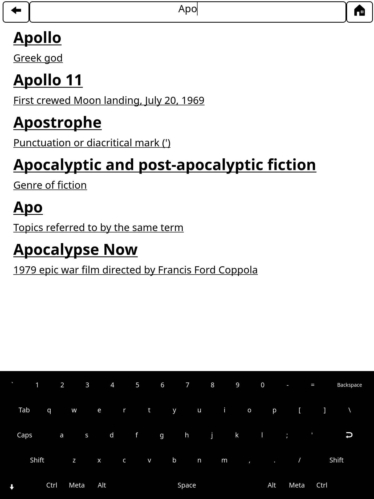

# remarkable-wikipedia

E-paper Wikipedia browser for reMarkable

## Background

When I was a kid, the [apocryphal!](https://en.wikipedia.org/wiki/Library_of_Alexandria) story of the fire at the library of Alexandria, the supposed loss of most human knowledge acquired to that date, was something that made me sad.  But in 1994, I became the excited owner of a [Microsoft Encarta](https://www.youtube.com/watch?v=QEE8bXCxhsE) CD and a Creative Labs CD-ROM drive that plugged in to my PC's soundcard. Optical disks with 750MB capacity - enough to store an whole *encyclopedia*, to replace the heaving bookshelves of Brittanica, were a technological marvel. How lucky we are, I'd think to myself, that the sum total of human knowledge is right here in my hand and could never become lost to future humankind. Today, of course, every CD-ROM I ever owned is unusable on modern devices and I understand that there's much more to human knowledge than fits in 750 MB, but the thought stuck with me. Wouldn't it be cool to have my own self-contained personal repository of human knowledge, accessible without an internet connection - my very own library of Alexandria? Wikipedia is today's canonical descendant of Encarta and Brittanica - wouldn't it be great to be able to carry it around and consult it wherever and whenever I wanted?

After years of kicking this idea around in my head, a chat with friends who apparently wanted it too and a snowy weekend in May provided the catalyst to actually make it happen!

Links:

* [Blog post](https://blog.singleton.io/posts/dont-panic/) (including legacy installation instructions)
* [Twitter](https://twitter.com/dps/status/1133608364913582080?ref_src=twsrc%5Etfw)

## Install

Disclaimer: *You hack on the internals of your reMarkable at your own risk — if you brick your tablet it's not my fault*

1. Install [`toltec`](https://toltec-dev.org/)
2. Install a launcher (optional):
    - [oxide](https://oxide.eeems.codes/)
    - [draft](https://github.com/dixonary/draft-reMarkable)
    - [remux](https://rmkit.dev/apps/remux)
3. Install this app...
   - ...with toltec: `opgk install wikipedia`
   - ...with [nao package manager](https://rmkit.dev/apps/nao):
     - Install nao: `opgk install nao`
     - Open nao, search for `wikipedia` and follow the prompts to install.

### Setting up for offline reading

The Wikipedia app looks in `/FIXME` for a file called `wikipedia.zim`. If it finds one, it loads Wikipedia from this file. Otherwise, it falls back on loading it over your internet connection.

#### reMarkable 1

1. Format your memory card as `ext4`, which is most easily done by connecting it to a Linux machine (I used a Raspberry Pi), but is [also possible with pain on Mac OS X](https://apple.stackexchange.com/questions/171506/formatting-usb-disk-as-ext4-on-mac), seriously, just find a Linux box.
2. Download Wikipedia to the memory card. The awesome folks over at the [kiwix project](http://www.kiwix.org) maintain an archive of Wikipedia pre-compressed into the compact [zim file format](https://www.openzim.org/wiki/ZIM_file_format). Visit the kiwix [content packages](https://wiki.kiwix.org/wiki/Content_in_all_languages) page and download the version of Wikipedia you want. Recommend are:
   - The [Simple English Wikipedia](http://download.kiwix.org/zim/wikipedia_en_simple_all_nopic.zim) (~354M) which fits comfortably in the internal storage of the reMarkable
   - The [Full English Wikipedia](http://download.kiwix.org/zim/wikipedia_en_all_nopic.zim) (35 GB).
4. Copy your Wikipedia file into the root directory of your `ext4` formatted SD card and name it `wikipedia.zim`
5. FIXME: do something to make the app look in the SD card?

#### reMarkable 2

The reMarkable 2 doesn't support OTG, so .zim files must be placed in the device's internal storage.

1. Download a Wikipedia .zim file as described above.
   - Recommended is the [354MB Simple English Wikipedia](http://download.kiwix.org/zim/wikipedia_en_simple_all_nopic.zim) since it will fit easily in the reMarkable's internal storage.
   - The full [English Wikipedia without pictures](https://dumps.wikimedia.org/other/kiwix/zim/wikipedia/wikipedia_en_all_nopic_2022-01.zim) is around 41GB
3. Plug the reMarkable in to your comupter and make sure it's awake
4. [Use `scp`](https://remarkablewiki.com/tech/file_transfer#file_transfer_via_scp) to transfer the .zim file into the `/FIXME` directory on your reMarkable
   - for example: `scp -v ~/Downloads/wikipedia.zim root@10.11.99.1:~/FIXME`

When starting, the app should now load Wikipedia from this file.

## Usage

Tapping *wikipedia* from your launcher or running `systemctl start wikipedia` from the command line on your reMarkable will start `qtremarkable` and render the Wikipedia main page. The app first tries to find a zimsever on `localhost:8081` and if its not running, falls back to the web. So, if you have an internet connection, or if you set up your installation for offline reading, you'll see the main page of English Wikipedia.

Tapping in the address bar at the top of the screen will bring up a keyboard so you can start looking for a specific Wikipedia page. These suggestions are *case-sensitive*.

Press the right and left hardware keys on reMarkable 1, swipe up or down on reMarkable 2, or use the software up and down buttons to scroll a full page down or up the article respectively. Tapping on links moves through articles as you'd expect and the *back* and *home* buttons at the top do what you'd expect.

Enjoy reading and learning!

### Gallery

## Contributing

PRs are welcomed!

### Developing

1. Install the Toltec toolchain: https://github.com/toltec-dev/toolchain

## License

[MIT](LICENSE)
